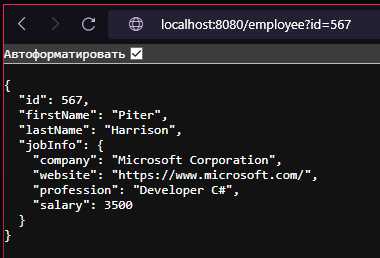

<div align="center">


<br>


---

</div>

## Dependency

[](https://jitpack.io/#MikhailSterkhov/jrest2)

> To use the data library in your project, you need to prescribe a dependency.
> Below is an example of how to use the dependency for different build systems:

#### Maven

Dependency block for Maven structure project:

```xml
<repositories>
    <repository>
        <id>jitpack.io</id>
        <url>https://jitpack.io</url>
    </repository>
</repositories>
```

```xml
<dependency>
    <groupId>com.github.MikhailSterkhov</groupId>
    <artifactId>jrest2</artifactId>
    <version>${jrest.version}</version>
</dependency>
```

#### Gradle

Dependency block for Gradle structure project:

```groovy
repositories {
	mavenCentral()
	maven { url 'https://jitpack.io' }
}
```

```groovy
compileOnly 'com.github.MikhailSterkhov:jrest2:${jrest.version}'
```

---

## What is this ?

**This library implements a complete HTTP/HTTPS protocol from scratch.**
<br>It currently supports the following versions of the HTTP protocol:

| VERSION    | SUPPORTED       |
|------------|-----------------|
| *HTTP/1.0* | ✅ Supported     |
| *HTTP/1.1* | ✅ Supported     |
| *HTTP/2*   | ⛔ Not Supported |
| *HTTP/3*   | ⛔ Not Supported |

On top of a completely self-contained protocol implementation is built 
<br>a **layered API structure** with different configurations and ways of 
<br>initializing and applying data to the connection flow.

Also, this library implements the ability to apply and read SSL certificates 
<br>to both the client part of the connection (read/write) 
<br>and the server part of the connection

---

## How to use?

Here are some examples of how to use the functionality of the top-level API to interact with the HTTP protocol

### CLIENTS

Let's start with the client part of the connection.

First of all, it is necessary to determine what type of channel we will work with and what we need.
For this purpose, the client factory is implemented `com.jrest.http.client.HttpClients`:

```java
// variants of Sockets implementation:
HttpClients.createSocketClient(ExecutorService);
HttpClients.createSocketClient(ExecutorService, boolean keepAlive);
HttpClients.createSocketClient(ExecutorService, int connectTimeout);
HttpClients.createSocketClient(ExecutorService, int connectTimeout, boolean keepAlive);
HttpClients.createSocketClient();
HttpClients.createSocketClient(boolean keepAlive);
HttpClients.createSocketClient(int connectTimeout);
HttpClients.createSocketClient(int connectTimeout, boolean keepAlive);

// variants of HttpURLConnection implementation:
HttpClients.createClient(ExecutorService);
HttpClients.createClient(ExecutorService, int connectTimeout);
HttpClients.createClient(ExecutorService, int connectTimeout, int readTimeout);
HttpClients.createClient();

// variants of binary http-client wrappers implementation:
HttpClients.binary(HttpClient httpClient, Reader reader);
HttpClients.binary(HttpClient httpClient, InputStream inputStream);
HttpClients.binary(HttpClient httpClient, File file) throws IOException;
HttpClients.binary(HttpClient httpClient, Path path) throws IOException;
```

Suppose we decide to implement a Socket connection with the ability 
<br>to make requests asynchronously, and we set its `connect-timeout = 3000ms`, 
<br>and `keep-alive = false` to automatically close the socket after the request is executed.

Example:

```java
HttpClient httpClient = HttpClients.createSocketClient(
        Executors.newCachedThreadPool(), connectTimeout, keepAlive);
```

Next, we can already call any of more than a hundred functions 
<br>to fulfill the request and get an instant response.

For example, send a GET request to the public web page `https://catfact.ninja/fact`, 
<br>from where we will get the result as JSON with a random fact about cats :D

Example:

```java
httpClient.executeGet("https://catfact.ninja/fact")
        .ifPresent(response -> {
            
            HttpProtocol protocol = response.getProtocol(); // HTTP/1.1
            String statusLine = response.getHeaders().getFirst(null); // HTTP/1.1 200 OK

            ResponseCode responseCode = response.getCode();
            
            if (!responseCode.isSuccessful()) {
                throw new RuntimeException("Content not found - " + responseCode);
            }

            System.out.println(httpResponse.getContent().getText());
            // {"fact":"A cat usually has about 12 whiskers on each side of its face.","length":61}
        });
```

The client API also implements one cool thing, thanks to which 
<br>you can simplify the implementation of HTTP requests as much 
<br>as possible by writing just a few words in the code to do it!

### BINARY FILES

Basic information you need to know when writing a binary:

The first lines are general Properties that can be applied in the queries themselves.
The most important among them is the `host = ...` line.
It is mandatory in application, and indicates the main address part of the URL that will be accessed.

Next after Properties are the functions.
Their structure is described by the following signature:

```shell
<name>: <METHOD> /<URI> {
  ...
}
```

The content of the function is divided into several keywords 
<br>that can be used within the body of the function:

- **head**: One of the headings of the query
- **attr**: URI attributes that will be appended to the URL with a '?' (e.g. /employee?id=1, where 'id' is an attribute)
- **body**: Request body
- - **length**: The size of the body to be sent under the guise of the 'Content-Length' header
- - **type**: The body type that will be sent under the 'Content-Type' header appearance
- - **text**: Header content as Hyper text

The values that come after the keyword are mostly 
<br>in the Properties format.

Example binary (`/catfacts.restbin`):

```shell
host = https://catfact.ninja/
randomCatFact = A cat usually has about 12 whiskers on each side of its face.
userAgent = JRest-Binary/1.1
contentType = application/json

getFact: GET /fact {
    head User-Agent = ${userAgent}
    head Accept = text/plain
    attr length = 50
}

createFact: POST /fact {
    head User-Agent = ${userAgent}
    body {
        type = ${contentType}
        text = {"fact": "${randomCatFact}", "length": 61}
    }
}
```

After successfully writing our binary, we can start executing it by first creating a BinaryHttpClient 
<br>via the factory: `HttpClients.createBinaryClient(HttpClient, <path-to-binary>)`

BinaryHttpClient has 2 additional methods that distinguish 
<br>it from other HTTP clients: `executeBinary(name)` and `executeBinaryAsync(name)`.

Example (_Java Client_):

```java
BinaryHttpClient httpClient = HttpClients.binary(
        HttpClients.createClient(),
        getClass().getResourceAsStream("/catfacts.restbin"));

httpClient.executeBinary("getFact")
        .ifPresent(httpResponse -> {

                HttpProtocol protocol = response.getProtocol(); // HTTP/1.1
                String statusLine = response.getHeaders().getFirst(null); // HTTP/1.1 200 OK

                ResponseCode responseCode = response.getCode();
            
                if (!responseCode.isSuccessful()) {
                    throw new RuntimeException("Content not found - " + responseCode);
                }

                System.out.println(httpResponse.getContent().getText());
                // {"fact":"A cat usually has about 12 whiskers on each side of its face.","length":61}
        });
```

And also for executing binary functions you can use input properties to 
<br>customize the request from the outside.

Here is an example.

Example (_binary with inputs_):

```shell
host = http://localhost:8080/

get_employee: GET /employee {
    attr id = ${input.employee_id}
}

post_employee: POST /employee {
    body {
        text = ${input.employee}
    }
}
```

Here we can notice the `${input.employee_id}` property, we expect 
<br>to get it from the client.
<br>Below I will give an example of applying it to an executable file.

Example (_Java Client_):

```java
BinaryHttpClient httpClient = HttpClients.binary(
        HttpClients.createClient(),
        HttpClientBinaryUrlTest.class.getResourceAsStream("/employee.restbin"));

httpClient.executeBinary("get_employee",
                Attributes.newAttributes().with("employee_id", 567))
        .ifPresent(httpResponse -> {
            
            System.out.println(httpResponse.getContent().getText());
            // {"id":567,"firstName":"Piter","lastName":"Harrison","jobInfo":{"company":"Microsoft Corporation","website":"https://www.microsoft.com/","profession":"Developer C#","salary":3500}}
        });
```

### SERVERS

To create a server and initialize it, things are a bit more complicated, 
<br>but only because it is a server, and it needs full business logic.

Let's start with the simplest creation of the server as an object, 
<br>form it from the parameters we need:

Example:

```java
HttpServer httpServer = HttpServer.builder()
        .build();
```

Several components are required to properly initialize the server, 
<br>each of which affects a specific part of the software part:


| PARAMETER TYPE    | USAGE EXAMPLE                                       | DESCRIPTION                                                                                                                          |
|-------------------|-----------------------------------------------------|--------------------------------------------------------------------------------------------------------------------------------------|
| InetSocketAddress | `.socketAddress(new InetSocketAddress(80))`         | *Server bindings address and port.*                                                                                                  |
| ExecutorService   | `.executorService(Executors.newCachedThreadPool())` | *Service to execute threads, if not specified, a cached thread pool is used. (CachedThreadPool is used by default if null is specified)* |
| HttpProtocol      | `.protocol(HttpProtocol.HTTP_1_0)`                  | *HTTP protocol, by default HTTP/1.1.*                                                                                                |
| SslContent        | `.ssl(SslContent.builder()...)`                     | *SSL settings for HTTPS, if null, HTTP is used.*                                                                                     |
| HttpListener      | `.notFoundListener(httpRequest -> ...)`             | *Listener to handle requests that have not found an appropriate handler. (404 Not Found)*                                            |

Now based on this information let's try to implement a server 
<br>that supports HTTP/1.1 protocol without SSL certificates

Example;

```java
HttpServer httpServer = HttpServer.builder()
        .socketAddress(new InetSocketAddress(8080))
        .build();

httpServer.bind();
```

We can now intercept requests that come to us by skipping or sending 
<br>back some kind of response. Request listeners can be either asynchronous 
<br>or synchronous.

Examples:

```java
httpServer.registerListener(httpRequest -> {
    
    System.out.println(httpRequest);
    return HttpResponse.ok();
});
```

```java
httpServer.registerAsyncListener("/employee", httpRequest -> 
        HttpResponse.ok(Content.fromEntity(
                Employee.builder()
                        .id(567))
                        .jobInfo(EmployeeJob.builder()
                                .company("Microsoft Corporation")
                                .website("https://www.microsoft.com/")
                                .profession("Developer C#")
                                .salary(3500)
                                .build())
                        .firstName("Piter")
                        .lastName("Harrison")
                        .build())));
```

---

Realizing perfectly well that handling each such request in the form of 
<br>registering them through listeners would not be entirely convenient, 
<br>especially in the case where there may be quite a few endpoints.

Therefore, the MVC module was implemented, providing a more flexible 
<br>and readable implementation of HTTP requests interception.

For the example, let's create an instance that will be a repository 
<br>of HTTP requests for our server and register it:

```java
@HttpServer
public class EmployeesHttpRepository {
}
```

```java
HttpServer httpServer = HttpServer.builder()
        .socketAddress(new InetSocketAddress(8080))
        .build();

httpServer.registerRepository(new EmployeesHttpRepository()); // <----
        
httpServer.bind();
```

<br>

**Now we can proceed to the nuances of its further construction, 
<br>because this is where the most interesting things begin!**

To implement some endpoint, we have several annotations that 
<br>allow us to do so:

- **@HttpRequestMapping**
- **@HttpGet**
- **@HttpPost**
- **@HttpDelete**
- **@HttpPut**
- **@HttpPatch**
- **@HttpConnect**
- **@HttpHead**
- **@HttpOptions**
- **@HttpTrace**

Let's start with the simplest one and implement the processing 
<br>of **GET** request to the path **/employee** with the possibility of 
<br>specifying the identifier of the Employee we need 
<br>through attributes (for example, **/employee?id=567**)

Example:

```java
@HttpServer
public class EmployeesHttpRepository {

    @HttpGet("/employee")
    public HttpResponse getEmployee(HttpRequest request) {
        Attributes attributes = request.getAttributes();
        Optional<Integer> attributeIdOptional = attributes.getInteger("id");

        if (!attributeIdOptional.isPresent()) {
            return ...;
        }
        return HttpResponse.ok(Content.fromEntity(
                Employee.builder()
                        .id(attributeIdOptional.get())
                        .jobInfo(EmployeeJob.builder()
                                .company("Microsoft Corporation")
                                .website("https://www.microsoft.com/")
                                .profession("Developer C#")
                                .salary(3500)
                                .build())
                        .firstName("Piter")
                        .lastName("Harrison")
                        .build()));
    }
}
```

Now, suppose in the line where we check for the passed 
attribute `!attributeIdOptional.isPresent()` we need to pass 
the processing of this request to the **NotFoundListener** that 
was specified **when HttpServer** was initialized.

To do this, we need to return the `HttpListener.SKIP_ACTION` constant:

```java
if (!attributeIdOptional.isPresent()) {
    return HttpListener.SKIP_ACTION;
}
```

But in this case it would be more correct to return 
<br>a `400 Bad Request` error, and for this we can call 
<br>the function from HttpResponse in one of two ways:

```java
if (!attributeIdOptional.isPresent()) {
    return HttpResponse.builder()
                .code(ResponseCode.BAD_REQUEST)
                .build();
}
```

or just:

```java
if (!attributeIdOptional.isPresent()) {
    return HttpResponse.badRequest();
}
```

---

Now when we query the `http://localhost:8080/employee?id=567` 
<br>page, we get the following result:



---

**But that's not all!**

The HTTP server repository has several other features that add 
some flexibility and convenience in exceptional cases of library use.

Let's go through some of them!

<br>

**Annotation @HttpBeforeExecution**:

Annotation allows you to pre-validate an incoming request, 
<br>change some parameters, or perform additional processes before 
<br>processing:

Example:

```java
@HttpBeforeExecution
public void before(HttpRequest httpRequest) {
    httpRequest.setHeaders(
            httpRequest.getHeaders()
                    .set(Headers.Def.USER_AGENT, "Mikhail Sterkhov")
    );
}
```

**Annotation @HttpAsync**:

You can hang this annotation on literally any method that handles queries.

It implements some kind of wrapper of the handler in separate threads, 
<br>if it is really necessary for the implementation.

Example:

```java
@HttpAsync
@HttpPatch("/employee")
public HttpResponse patchEmployee(HttpRequest request) {
    Employee employee = request.getContent().toEntity(Employee.class);
    try {
        employeesService.patch(employee);
        return HttpResponse.ok();
    } 
    catch (EmployeeException exception) {
        return HttpResponse.internalError();
    }
}
```

---

## Support a Developments

<div align="center">

> **Development by <a href="https://github.com/MikhailSterkhov">@MikhailSterkhov</a>**
> <br>We can support me here:
> <br><br><a href="https://www.buymeacoffee.com/itzstonlex" target="_blank"></a>

</div>
